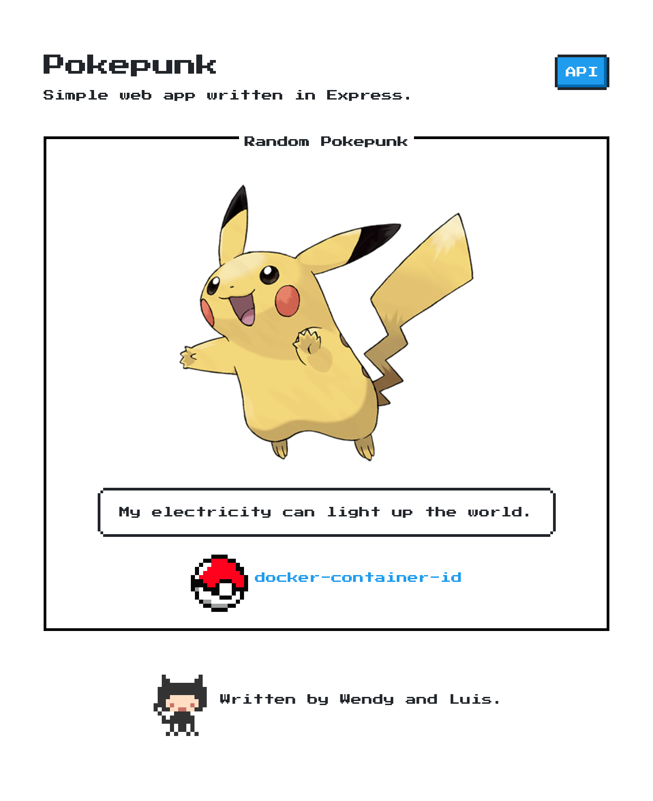

# pokepunk

Workshop №2 on services and Docker Swarm for the course “Software
Architectures” (ST0261) taught by professor Daniel Correa at EAFIT University
during the 2025-1 semester. This project is AKA «pokenea».



## Installation

1. Build the Docker image:

    ```shell
    docker build --pull --tag pokepunk .
    ```

2. Run the container:

    ```shell
    docker run --detach --publish 80:80 pokepunk
    ```

## Journal

1. Initialize the application (create the `package.json`):

    ```shell
    npm init
    ```

2. Install the Express framework:

    ```shell
    npm install express
    ```

3. Use the [application generator tool][skeleton] to create the skeleton:

    ```shell
    npx express-generator         # Run the generator
    npm install                   # Install dependencies
    DEBUG=pokepunk:* npm start    # Run the development server
    ```

[skeleton]: <https://expressjs.com/en/starter/generator.html>

## Authors

Wendy Daniela Benítez Gómez and Luis Miguel Torres Villegas.

## License

Unlicense
